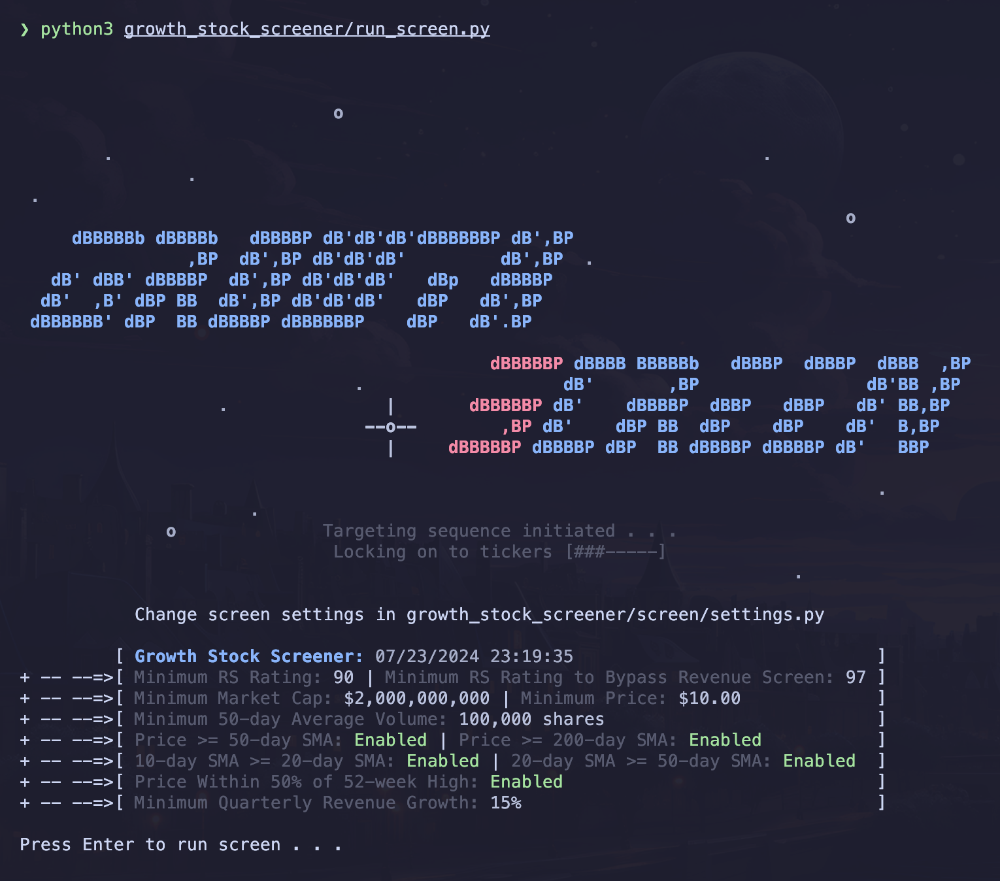
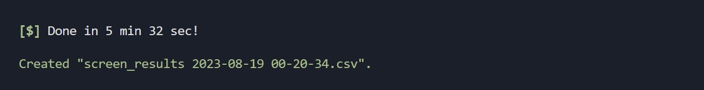
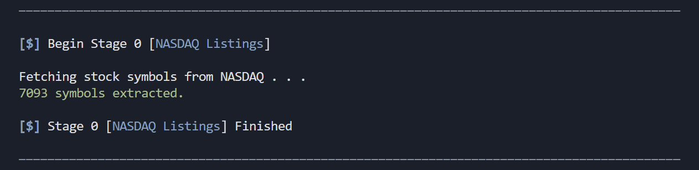

# Growth Stock Screener 
[](https://tanishmakadia.com/projects/stock-screener)

An automated stock screening system which isolates and ranks top-tier growth companies based on relative strength, liquidity, trend, revenue growth, and institutional demand.

### Features:

- **Five** distinct [screen iterations](#screen-iterations) based on time-tested criteria for predicting stock super-performance.
  - RS Ratings calculated using methodology from [William O'Neil Securities](https://www.williamoneil.com/proprietary-ratings-and-rankings/).
  - Stage-2 uptrend criteria derived from strategies of U.S. investing champions Mark Minervini and Oliver Kell.
  - Revenue growth sourced directly from the SEC's EDGAR [XBRL data APIs](https://www.sec.gov/edgar/sec-api-documentation).
- **Customizable** screen [settings](growth_stock_screener/screen/settings.py) for fine-tuning.
- **Rapid** web scraping using asynchronous requests.
  - Utilize [aiohttp](https://docs.aiohttp.org/en/stable/) and [asyncio](https://docs.python.org/3/library/asyncio.html) when desired data is present in a website's static HTML structure.
  - Deploy a thread pool to launch concurrent [Selenium](https://www.selenium.dev/) browser instances when desired data is dynamically added to the DOM by JavaScript.
- **Parsable** [JSON outfiles](growth_stock_screener/json/README.md) for evaluation of screen criteria.
- **Colorful** logging in the terminal.
- **Easy-to-access** .csv outfiles storing [screen results](#viewing-results).
- **Support** for Linux, Mac, and Windows.
  - Tested on Ubuntu 22.04.3, macOS Sonoma 14.5 (23F79), and Windows 11 22H2.

## Installation

#### Prerequisites

First, ensure that you have [Python 3.11+](https://www.python.org/) and [Firefox](https://www.mozilla.org/en-US/firefox/new/) installed.

> **_Note for Mac users:_** _Python now includes its own private copy of OpenSSL and no longer uses Apple-supplied OpenSSL libraries. After installing Python, navigate to your `Applications/Python X.XX/` folder and double-click `Install Certificates.command`._

> **_Note for Linux users:_** _the 'snap' version of Firefox that comes pre-installed may cause issues when running Selenium. To troubleshoot, follow [these instructions](https://www.omgubuntu.co.uk/2022/04/how-to-install-firefox-deb-apt-ubuntu-22-04) to install Firefox via 'apt' (not snap)._

Next, navigate to the directory where you would like to install the screener, and run the following commands in a terminal application:

#### Clone this Repository:

```bash
git clone https://github.com/starboi-63/growth-stock-screener.git
```

#### Navigate to the Root Directory:

```bash
cd growth-stock-screener
```

#### Install Python Dependencies:

```bash
pip3 install -r requirements.txt
```

## Usage

#### Running the Screener:

```bash
python3 growth_stock_screener/run_screen.py
```

#### Modifying Settings:

To customize screen settings, modify values in [settings.py](growth_stock_screener/screen/settings.py).

#### Viewing Results:

Screen results are saved in .csv format in the project root directory, and can be opened with software like Excel.



#### Troubleshooting Errors:

By default, the screener attempts to calculate an ideal number of concurrent broswer instances to create based on the number of CPU cores present on your machine. In rare cases, this number may be too high. If you notice failed stock symbols with errors such as `Browsing context has been discarded`, `Tried to run command without establishing a connection`, `WebDriver session does not exist`, or `Failed to decode response from marionette` during the [trend](#iteration-3-trend) or [institutional accumulation](#iteration-5-institutional-accumulation) iterations, you are likely creating _too many_ browser instances at once.

Consider _decreasing_ the value of `threads` in [settings.py](growth_stock_screener/screen/settings.py) to 1-3 if you are experiencing this.

## Screen Iterations

An initial list of stocks from which to screen is sourced from _NASDAQ_.



Then, the following screen iterations are executed sequentially:

### Iteration 1: Relative Strength

The market's strongest stocks are determined by calculating a raw weighted average percentage price change over the last $12$ months of trading. A $40\\%$ weight is attributed to the most recent quarter, while the previous three quarters each receive a weight of $20\\%$.

$$\text{RS (raw)} = 0.2(Q_1\ \\%\Delta) + 0.2(Q_2\ \\%\Delta) + 0.2(Q_3\ \\%\Delta) + 0.4(Q_4\ \\%\Delta)$$

These raw values are then assigned a _percentile rank_ from $0\to 100$ and turned into _RS ratings_. By default, only stocks with a relative strength rating greater than or equal to $90$ make it through this stage of screening.

### Iteration 2: Liquidity

All _micro-cap_ companies and _thinly traded_ stocks are filtered out based on the following criteria:

$$
\begin{aligned}
\text{Market Cap} &\geq \$1\ \text{Billion}\\
\text{Price} &\geq \$10\\
50\ \text{day Average Volume} &\geq 100,000\ \text{Shares}
\end{aligned}
$$

### Iteration 3: Trend

All stocks which are not in a _stage-two_ uptrend are filtered out. A stage-two uptrend is defined as follows:

$$
\begin{aligned}
\text{Price} &\geq 50\ \text{Day SMA}\\
\text{Price} &\geq 200\ \text{Day SMA}\\
10\ \text{Day SMA} &\geq 20\ \text{Day SMA} \geq 50\ \text{Day SMA}\\
\text{Price} &\geq 50\\%\ \text{of}\ 52\ \text{Week High}
\end{aligned}
$$

### Iteration 4: Revenue Growth

Only the most rapidly growing companies with _high revenue growth_ are allowed to pass this iteration of the screen. Specifically,
the percent increase in the most recent reported quarterly revenue versus a year ago must be at least $25\\%$; if available, the percent increase in the prior period versus the same quarter a year ago must also be at least $25\\%$. Revenue data is extracted from XBRL from company 10-K and 10-Q _SEC_ filings, which eliminates foreign stocks in the process.

The current market often factors in _future_ revenue growth; historically, this means certain exceptional stocks have exhibited super-performance _without_ having strong on-paper revenue growth (examples include NVDA, UPST, PLTR, AI, etc.). To ensure that these stocks aren't needlessly filtered out, a small exception to revenue criteria is added: stocks with an $\text{RS} \geq 97$ can bypass revenue criteria and make it through this screen iteration.

### Iteration 5: Institutional Accumulation

Any stocks with a _net-increase_ in institutional-ownership are marked as being under accumulation. Institutional-ownership is measured by the difference in total inflows and outflows in the most recently reported financial quarter. Since this information lags behind the current market by a few months, no stocks are outright eliminated based on this screen iteration.
